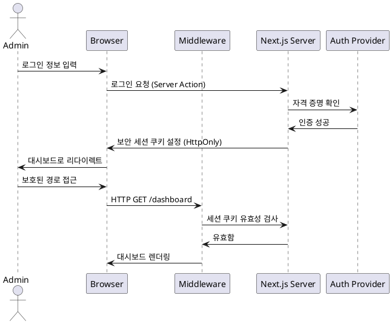

# 시스템 아키텍처: 어드민 콘솔

## 1. 상위 레벨 설계
어드민 콘솔은 **Next.js 14+ (App Router)** 기반의 풀스택 프레임워크로 구축되었습니다. 성능을 위한 React Server Components와 보안성이 강화된 데이터 수정을 위한 Server Actions를 활용합니다.

## 2. 인증 흐름
다음은 보안 인증 프로세스를 보여주는 시퀀스 다이어그램입니다:

## 3. 기술 스택
- **프레임워크**: Next.js 14+ (App Router)
- **언어**: TypeScript
- **스타일링**: Tailwind CSS
- **인증**: NextAuth.js (세션 기반)
- **검증**: Zod
- **아이콘**: Lucide React
- **데이터 페칭**: React Server Components / Server Actions

## 4. 보안 통제 (Security Controls)
- **미들웨어**: `/admin/*` 및 `/dashboard/*` 경로의 전역 보호.
- **CSRF**: Next.js Server Actions를 통한 내장 보호.
- **XSS**: React의 자동 새니타이징(Sanitization).
- **세션**: HttpOnly, Secure, SameSite=Lax 쿠키 정책.
